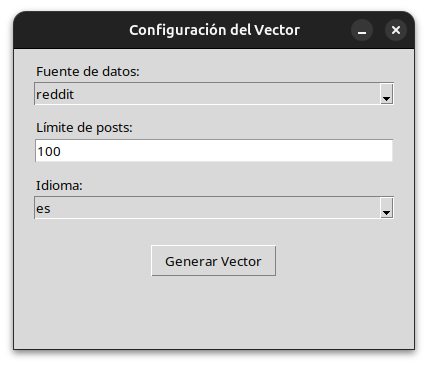
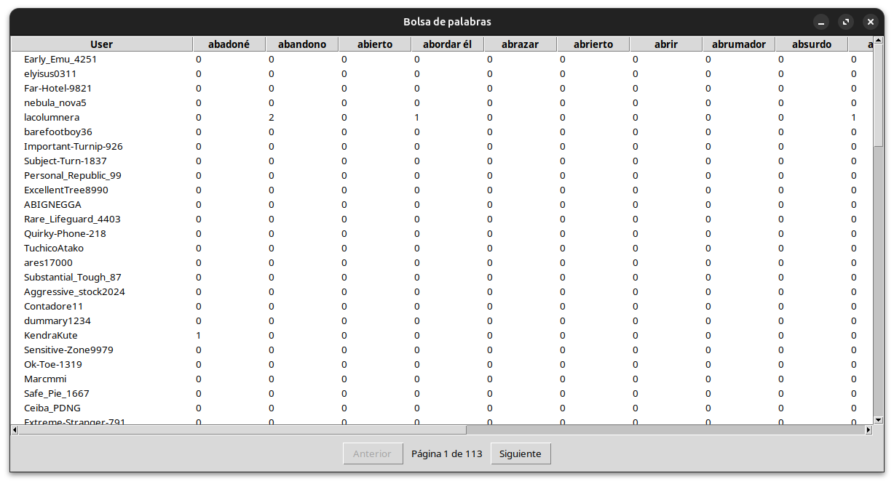
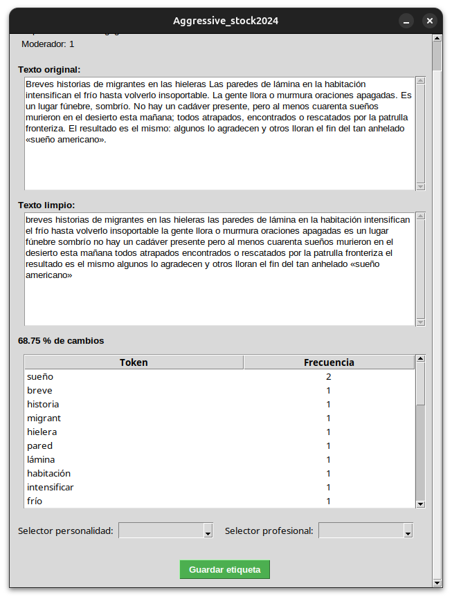

# User Profile

Proyecto para extraer y procesar automáticamente información textual de usuarios en Reddit y YouTube, generando vectores representativos para facilitar el etiquetado manual de perfiles específicos. Incluye técnicas de preprocesamiento, análisis de datos y una aplicación para visualización y clasificación manual de los perfiles.

---

## Tabla de Contenidos

- [Instalación](#instalación)
- [Uso](#uso)
- [Características](#características)
- [Contacto](#contacto)

---
## Instalación

Sigue estos pasos para preparar el entorno y las dependencias necesarias:

1. Clonar el repositorio:
```bash
git clone https://github.com/Ismael-droid-01/user_profile.git
cd user_profile
```

2. Crear y activar un entorno virtual de Python para aislar las dependecias:
```bash
python -m venv venv
source venv/bin/activate
``` 

3. Instalar las librerías requeridas:
```bash
pip install -r requirements.txt
```

4. Descargar los modelos de lenguaje spaCy para español e inglés:
```bash
python3 -m spacy download es_core_news_sm
python3 -m spacy download en_core_web_sm
```
---
## Uso
1. Asegúrate de tener el entorno virtual activado (source venv/bin/activate).
2. Ejecuta el proyecto
```bash
python3 main.py
```
3. Configura la bolsa de palabras seleccionando:
    + Fuente de datos
    + Límite de posts
    + Idioma    


4. Navega y selecciona registros con paginadores y doble clic:


5. Etiqueta manualmente los perfiles de usuario según personalidad y profesionalidad y guarda el vector resultante en formato CSV para su posterior análisis:

---
## Características
- Extracción automática de texto desde Reddit y YouTube.

- Preprocesamiento avanzado para limpieza y normalización textual.

- Generación de vectores representativos para análisis de perfiles.

- Interfaz gráfica intuitiva para visualización y etiquetado manual.

- Soporte multilingüe: español e inglés con modelos spaCy.

- Navegación y paginación eficiente para manejar grandes volúmenes de datos.
---
## Contacto
- Correo: gocs020101@gs.utm.mx